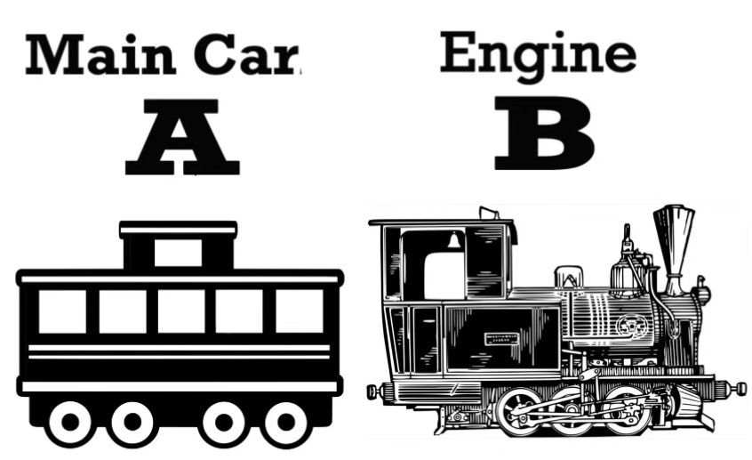
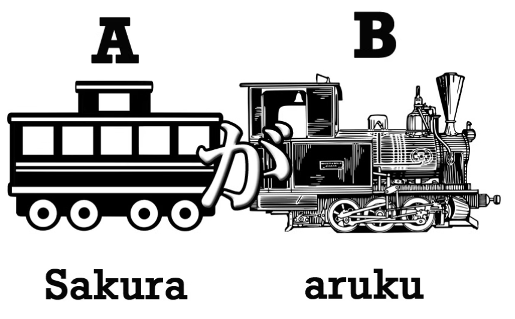

# מבוא
## הבסיס למשפט היפני
המשפטים ביפנית תמיד בנויים באותה צורה, כמו רכבת משא משני חלקי בסיס:

1.	קרון המשא – יש לפחות אחד כזה ובלעדיו אין סיבה לרכבת לנוע

    > נחלק את קרונות המשא לקרונות שחורים (חובה, חלק מבסיס המשפט) וקרונות לבנים (אופציונליים בשביל להרחיב את המשפט-נראה אותם בהמשך)
2.	הקטר –אחראי להזיז את כל העניין

**נזכור שבכל שפה יש סה"כ 2 סוגי משפטים:**
1.	משפטי תיאור: A הוא B 
::: tip דוגמה
סאקורה הוא יפני
:::
2.	משפטי פעולה: A עושה B 
::: tip דוגמה
סאקורה הולך
:::

## משפטי פעולה

נניח ואנחנו רוצים להגיד `סאקורה הולך`, זה משפט פעולה ונוכל להגיד שהמשא הוא [桜]{さくら} ואילו הקטר הוא [歩く]{あるく}, אבל מה נעשה כדי לחבר ביניהם?

התשובה היא `が`  -  הסימנית הבסיסית ביותר ביפנית **והיא קיימת בכל משפט בשפה** (אפילו אם לא בצורה מילולית, היא תסתתר בפנים)!
נחבר את השניים ונקבל את המשפט [桜が歩く]{さくらがあるく} – סאקורה הולך.

## משפטי תיאור (אוגד)
תזכורת: האוגד מקשר בין הנושא לנשוא במשפט
באותה צורה, נוכל לבנות משפט תיאור ולהגיד `סאקורה הוא יפני`, באופן דומה נדביק את המילים [桜]{さくら} ו- [日本人]{にほんじん} בעזרת הסימנית `が` אבל כדי לקבל את הגוף במשפט (הוא, היא, הם וכו'),  נצטרך להוסיף עוד דבר קטן והוא האוגד `だ` – נשלב את הכל ונקבל [桜が日本人だ]{桜が日本人だ}

כיוון שמילות תואר מסתיימות בד"כ ב-`い` – לא נצטרך להוסיף אוגד למשפט (`だ`) כיוון שהוא נכלל בתוכו.
	דוגמה: עט הוא אדום – [ペンが赤い]{ペンがあかい}
כעת, אם נסכם בפשטות את שלושת סוגי המשפטים ביפנית נבין שכל המשפטים מתחילים בנושא שמחובר בעזרת `が` ומסתיים באחת משלושת הדרכים הבאות (3 סוגי רכבות משא):

1. פועל – מסתיים בצליל `う`(A עושה B)
2. שם עצם –מסתיים ב- `だ` (A הוא B)
3. תיאור – מסתיים בצליל `い` (A הוא B)
