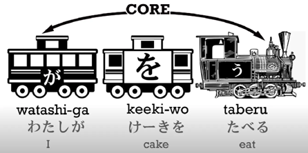

# 2. הקרון הבלתי נראה

כפי שנאמר, כל משפט ביפנית כולל שני חלקי בסיס – קרון המשא והקטר (A ו-B) שידועים גם כ`דבר שאנחנו מדברים עליו` ו`מה אנחנו אומרים על הדבר הזה` וכמו שכבר נאמר ניתן להוסיף עוד ועוד קרונות משא שונים שיכולים להפוך כל משפט לטיפה מסובך יותר. **מה שחשוב** הוא שבסוף כל המשפטים כוללים את אותו בסיס שדובר עליו בחלק הקודם.

כעת נתחיל להסתכל על קרונות משא חדשים, אך לפני כן נבחין בכלל מעניין:

**בכל משפט ביפנית נוכל לראות את הקטר, אך לא בהכרח את קרונות המשא** – אין זה אומר שהם לא שם! הם פשוט הוחלפו בקרונות משא **בלתי נראים.**

**אז מה זה קרון משא בלתי נראה?** ובכן, בעברית הדבר הקרוב ביותר הוא כינוי גוף (הוא, היא, זה, אותו, אותה וכו').

נתבונן בדוגמה פשוטה:

> *יפנית משתמשת במערכת כתיבה מורכבת של קאנג'י, הירגאנה וקאטאקנה.
כשלומדים את השפה היפנית, השפה היפנית יכולה להיות מבלבלת מאוד.
אם לא מתרגלים את השפה היפנית, השפה היפנית נשכחת מהר.*

ברור לכולנו שזה רצף משפטים קצת מוזר נכון? כבר הבנו על מה אנחנו מדברים אחרי המשפט הראשון, אין צורך להמשיך ולציין שמדובר ביפנית, נוכל להגיד:

> *יפנית משתמשת במערכת כתיבה מורכבת של קאנג'י, הירגאנה וקאטאקנה.
כשלומדים אותה, היא יכולה להיות מבלבלת מאוד.
אם לא מתרגלים אותה, היא נשכחת מהר.*

נוכל לשים לב שאותם כינויי גוף הם חסרי משמעות **בלי הקשר**.
עכשיו ננסה להגיד את אותו דבר בלי כינויי גוף:

> *יפנית משתמשת במערכת כתיבה מורכבת של קאנג'י, הירגאנה וקאטאקנה.
כשלומדים, יכולה להיות מבלבלת מאוד.
אם לא מתרגלים, נשכחת מהר.*

נכון, זה לא תחביר נכון בעבירת, אבל די ברור לנו למה מתכוונים וביפנית זה דבר מקובל, מחליפים את כינויי הגוף בקרון בלתי נראה – נקרא לו כינוי גוף ריק, הוא שם, אבל הוא בלתי נראה!

נתבונן בדוגמאות קונקרטיות:

:::info דוגמה 1
אפשר להגיד `マタンだ`, משמע `אני מתן`, זה נראה כאילו יש לנו רק קטר אבל בעצם יש לנו כאן קרון משא בלתי נראה, המשפט המלא הוא בעצם `(∅が)マタンだ` ובעצם ∅ מחליף את המילה `אני`. נוכל להגיד ש`אני` הוא ברירת המחדל ל**כינוי גוף ריק**
:::

:::info דוגמה 2
בצורה דומה אפשרי להגיד [土曜日だ]{どようびだ}`（∅が）` - (היום הוא) יום שבת
:::

המשפטים הללו הם משפטים מלאים ותקינים ביפנית, עם נושא שמסומן ב が (קרון משא) וקטר.

## הסימנית を

כעת נלמד על הסימנית を - תפקידה לסמן את האובייקט (הדבר/שם העצם שעושים לו משהו) במשפט, הסימנות הזו היא לא חלק חובה במשפט, אפשר לחשוב על הקרון משא שלה בתור קרון לבן (אופציונלי).

::: info דוגמה
המשפט [私がケーキを食べる]{わたしがケーキをたべる} - אני אוכל עוגה כולל בתוכו את הסימנית

- בסיס המשפט הוא `אני אוכל` (קרונות שחורים)
- הקרון הלבן `けーきを` - מרחיב לנו על הפעולה (הקטר)
:::

באותה מידה נוכל `לאבד` את הרישא [私が]{わたしが} ולהניח שמדובר שוב בקרון בלתי נראה.
