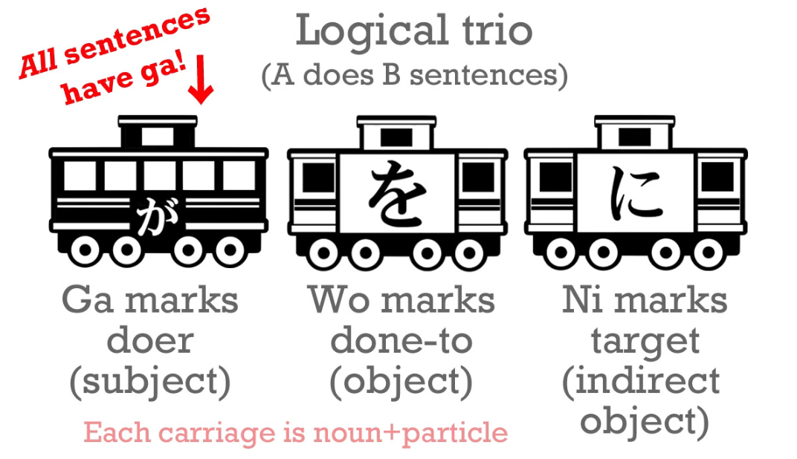
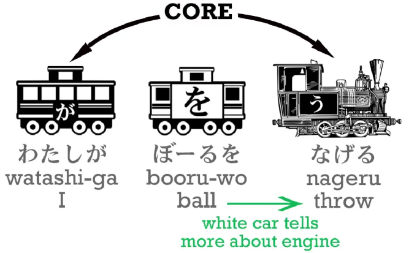
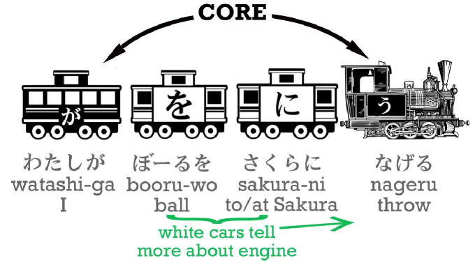
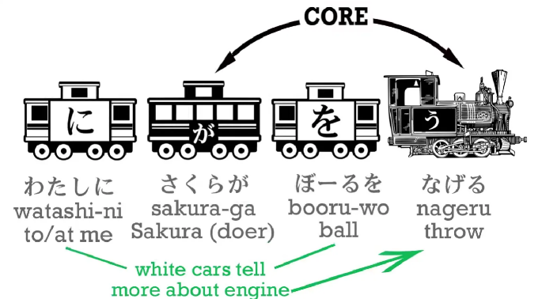
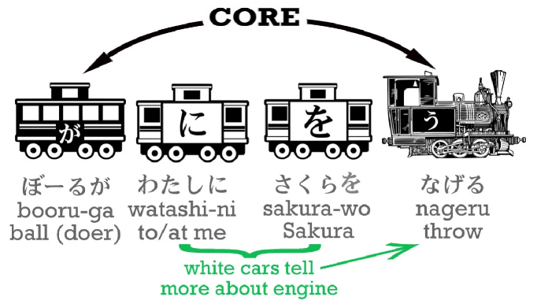

# 3. סימנית ה -は וקרון ה -に

אחד מהדברים היותר מבלבלים בלימוד השפה היפנית הוא ההבדל בין `は` ל- `が`, ננסה להבהיר אותו בצורה פשוטה.

נתחיל מכלל חשוב ובסיסי
::: danger כלל 1
הסימנית `は` לעולם לא תהיה חלק מבסיס המשפט - לא כחלק מקרונות המשא השחורים ולא חלק מהקטר

בצורה דומה, היא לא יכולה להיות קרון לבן כיוון שקרונות לבנים הם חלק מהמבנה הלוגי של המשפט
:::

## מה היא סימנית は

אז אם הסימנית לא קרון שחור ולא קרון לבן, מה היא? איזה סוג של קרון?

התשובה היא - היא לא קרון כלל! אפשר לחשוב עליה בתור הדגל שנעוץ על קרון שכולל בתוכו שם עצם. למה דווקא דגל? כי זה מה שזה! הסימנית מגיעה **לסמן** משהו בתור הנושא של המשפט ותו לא, היא לא אומרת שום דבר על הנושא, בשביל זה יש את המשפט הלוגי.

במילים אחרות אם נסתכל על המשפט [私はイスラエル人だ]{わたしはイスラエルじんだ} נקבל משפט שמורכב קצת מוזר - `באשר אלי, ישראלי` - משפט קצת מוזר נכון? כי חסר לנו מישהו שיסומן ב-が! נוסיף אותו ונקבל: [私は(∅が)イスラエル人だ]{わたしは・がイスラエルじんだ} וזה משפט שלם - `באשר אלי, (אני) ישראלי` 

### כוחו של הקשר

עכשיו נתאר סיוטאציה מעניינת, אתם יושבים במסעדה והמלצר שואל אתכם מה אתם רוצים לאכול - בתגובה אתם יכולים לענות `私は鰻だ` - מה שיכול להראות במבט ראשון כ-`באשר אלי, אני צלופח` מתברר כשגיאה בסיסית, וכאן בעצם ההקשר נכנס למשחק, כשמבינים שבהתאם לסיטואציה זה דווקא נשמע הגיוני! `באשר אלי, אני (אוכל) צלופח` - דבר שניתן להבין **מההקשר**

## קרון ה-に

הקרון (הלבן) השלישי בשלישיית המוסקטרים שלנו שעוזרת לנו לייצר משפטים לוגיים ביפנית:

במשפטי `A עושה B` הסימנית が אומרת **מי עושה את המעשה**, を מסמנת **על מה הוא נעשה** ואילו に מסמנת את **המטרה הסופית של המעשה** - אבל כפי שהסברנו, קרונות לבנים הם אופציונליים ולכן שתי הסימניות האחרונות לא חייבות להמצא במשפט.

אבל בואו נתבונן במשפט הבא: [私がボール投げる]{わたしがボールをなげる} שאומר `זרקתי כדור`. הליבה של המשפט היא `אני זרקתי` - [私が投げる]{わたしがなげる} והקרון הלבן אומר לנו מה זרקנו - כדור.

עכשיו אם נעשה שימוש בקרון ה-に נקבל: [私がボールを桜に投げる]{わたしがボールをさくらになげる} - `אני זרקתי כדור על סאקורה (או לסקאורה)`. סאקורה הוא היעד, המטרה של הזריקה.

ומה המסקנה?

::: warning מסקנה
סדר המילים לא בדוגמה לא משנה כמו בעברית, הסימניות שדיברנו עליהן יוצרות את כל הלוגיקה במשפט!
:::

במילים אחרות אם נשתמש באותו משפט בדיוק אבל נחליף את הסדר של הסימניות: [私に桜がボールを投げる]{わたしにさくらがボールをなげる} נקבל `סאקורה זורק את הכדור אלי (או עלי)` ובאותה צורה נוכל 

אפילו לייצר משפטים מספרי פנטזיה כמו [ボールが私に桜を投げる]{ボールがわたしにさくらをなげる} - `הכדור זורק עלי (אלי) את סאקורה`

נוכל להגיד **כל מה שאנחנו רוצים ביפנית** כל עוד נשתמש באותן סימניות לוגיות בצורה נכונה.

### מה קורה איתך は?

עכשיו נכניס את החבר היקר שלנו は אל הסיפור.
כנראה שלא מעט ממי שקורא את זה כבר הכיר את הסימנית הזו, וככל הנראה הוא גם התחיל להתבלבל, מתי להשתמש בה או בסימנית が?
הנקודה החשובה - **הן שונות בתכלית, ואין פה סיטואציה שאחד יילקח על פני האחר**

נזכור ש- は מתפקדת כסימנית **לא לוגית** ולכן היא לא משפיעה על הלוגיקה של המשפט, רק משנה את הדגש שאנחנו נותנים במשפט.

נתחיל מלהכניס אותה למשפט שדיברנו עליו לפני רגע: [私は桜にボールを投げる]{わたしはさくらにボールをなげる} - כמו שאנחנו יודעים כבר, המשפט יתורגם ל- `באשר אלי, אני זרקתי את הכדור על סאקורה`

::: info הערה
אני אפסיק לכתוב מעתה והלאה את שתי המשמעויות עלי/אלי במשפט, לשם פשטות.
:::

עכשיו בואו נשים את は על הכדור - [ボールは私が桜に(∅を)投げる]{ボールはわたしがさくらに・をなげる} - `באשר לכדור, אני זרקתי אותו(את הכדור) על סאקורה` (שימו ❤️ ש-∅を הפך בלי לשים לב ל-`אותו`)

נתייחס ל-2 משמעויות של הוספת は למשפט:
1. המשמעות הבאמת חשובה - הוספנו סימנית נוספת אבל המשמעות **הלוגית** של המשפט לא השתנתה כלל כיוון שלא שינינו את המיקום של הסימניות הלוגיות או את השמות עצם שמקושרים אליהן
2. המשמעות הנסתרת יותר - העברנו את הדגש במשפט לשם העצם אליו מקושרת は

:::warning מסקנה
הסימנית は משנה רק את הדגש על מה מדברים במשפטים וכלל לא את הלוגיקה במשפט עצמו!
:::