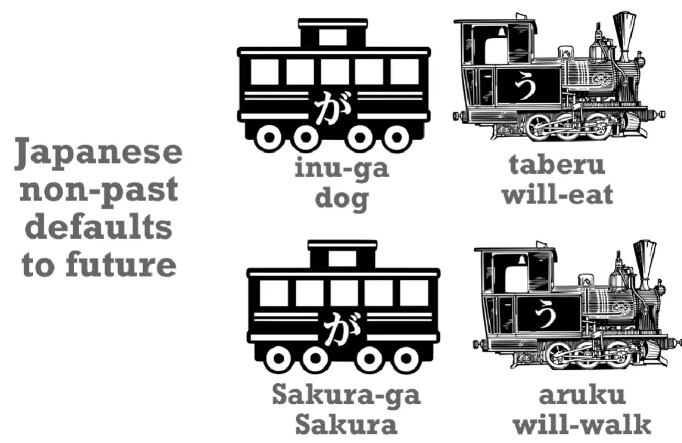
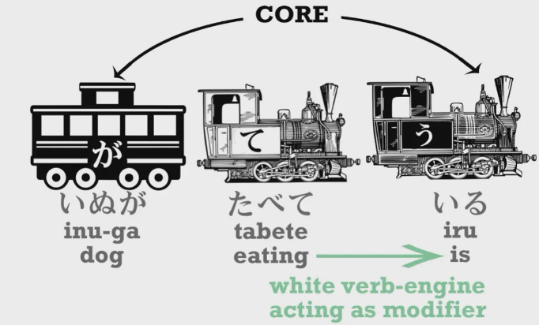
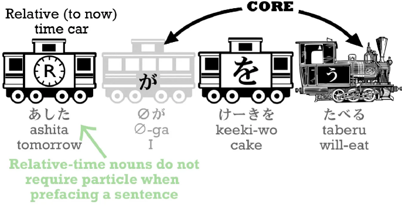
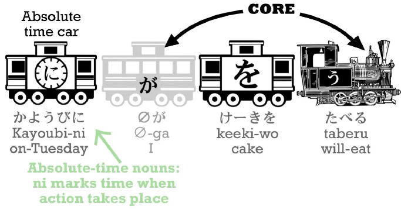

# הטיות פעלים ביפנית

ביפנית, שלא כמו בעברית, אם נשתמש בפועל הפשוט (מה שנקרא "הגדרה מילונית") נדבר בד"כ על פעולה שתיעשה בעתיד, זה טבעי כיוון שביפנית אין אותיות אית"ן.

כתוצאה מכך נחלק את הטיות הפעלים ביפנית ל-3 סוגים אותם נכיר בחלק זה ובבאים אחריו.

## הטית "לא-עבר"

בעברית כשאנחנו מדברים על פעולות שנעשות בהווה אנחנו משתמשים בצורה המילונית של הפועל (אֹכֶל, הוֹלֵךְ וכו'), לעומת זאת, ביפנית אנחנו משתמשים בצורה המילונית של הפועל בד"כ כאשר אנחנו מדברים על פעולות שיקרו בעתיד - [犬が食べる]{いぬがたべる}=`הכלב יאכל`, [桜が歩く]{さくらがあるく}=`סאקורה ילך`

## פעולות המשכיות וסיומת ている

אם נרצה לדבר בצורה טבעית ביפנית ולהגיד `סאקורה הולך עכשיו` נצטרך לשנות את הפועל כדי להביע את העובדה שהפעולה קוראת עכשיו בצורה מתמשכת, למזלינו ביפנית זה די קל, לא צריך להוסיף מילים נוספות למשפט אלא להשתמש בסיפא מסוימת שעושה בדיוק את זה.

תחילה נבחין במילה `いる` שמשמעותה היא `להיות` (רק בהקשר של חיות ובני אדם, משמע אובייקטים שחיים וזזים) נשתמש בה כדי להטות את הפועל להווה ממושך (פעולה שקורת כעת) ונקבל: [桜が歩いている]{さくらがあるいている}

זה יכול להשמע משעשע אבל זה כמו להגיד `סאקורה להיות הולך`, זה מאוד עקום בעברית אבל זו הכוונה.

:::info הערה
באנגלית ההקבלה פשוטה יותר - `Sakura is walking` - יותר דומה למה שקורה ביפנית, המילה `is` היא כמו המילה `いる` ובעצם מתפקדת בצורה דומה.
:::

עכשיו, נבחין שבמשפט כמו [犬が食べている]{いぬがたべている}, יש לנו משהו שעוד לא ראינו - **קטר לבן**: **קטר לבן הוא אלמנט שיכול להוות כקטר במשפט אבל במקרה הזה הוא לא הקטר במשפט. הוא משנה או אומר לנו משהו נוסף על אלמנט בסיסי כלשהו במשפט.**

אז הגרעין במשפט שלנו הוא [犬がいる]{いぬがいる} - `הכלב להיות`, אבל הכלב לא סתם קיים (להיות) - הוא עושה משהו, והקטר הלבן הזה אומר לנו מה הוא עושה, הוא אוכל!

:::info הערה
בהקבלה דומה לאנגלית, שוב, נבחין כי הפועל [食べる]{たべる}　השתנה בצורה מוסימת, כפי שבאנגלית אנחנו משנים את הפועל ומוסיפים סיומת `ing`, כך גם ביפנית צריך לשנות את הפועל ולהשתמש בצורת て של הפועל.
:::

אבל איך יוצרים את `הצורת-て` הזו שמשתמשים בה בשביל להציג הווה מתמשך? במילים כמו [食べる]{たべる} זה מאוד פשוט, מחליפים את `る` ב-`て`, במצבים אחרים צריך להבחין בקבוצות שונות של פעלים כדי לבצע את ההטיה, נלמד על זה [בדף המתאים](5-verb_groups_te_form)

## הטית עבר

אז איך משנים את המשפטים לזמן עבר? ברוב הפעמים פשוט משנים את הפועל לסיומת `た` - זה כל הסיפור.

:::info דוגמה
אם המשפט [犬が食べる]{いぬがたべる} - `הכלב יאכל` אז שינוי של `る` ל- `た` יניב: [犬が食べた]{いぬがたべた} - `הכלב אכל`
:::

למזלינו יפנית היא שפה מאוד טכנית וכדי לשנות את הפעלים לעבר עם הוספת `た` יהיה זהה לשינוי שאנחנו עושים בשביל לקבל את צורת ה-`て` - שוב, הכל יוסבר ב[שיעור הבא](5-verb_groups_te_form).

## ביטויי זמן
בשביל לבטא את הזמן אנחנו פשוט נוסיף אותו בהתחלת המשפט, ממש כמו בעברית, לדוגמה אם נוסיף `מחר` בתחילת המשפט `אני אוכל עוגה`, גם בלי ניקוד נבין שמדובר בעתיד - `מחר אני הולך לאכול עוגה` וביפנית נוכל להשתמש במילה [明日]{あした} - `מחר`.

:::info דוגמה
`מחר אני הולך לאכול עוגה` - [明日(∅が)ケーキを食べる]{あした・がケーキをたべる}
:::

### זמן יחסי

נ שים לב ש`מחר` זו מילה שמבטאת `זמן יחסי` - כיוון שהוא יחסי להיום - היום הוא המחר של אתמול.

זמן יחסי יכול להיות גם:

- אתמול
- מחרתיים
- שבוע הבא
- חודש שעבר
- שנה הבאה

### זמן מוחלט

כשמו כן הוא, זמן מוחלט הוחלט מראש וקבוע, הוא לא יחסי להווה, כמו `יום שלישי` או `בשעה שש` - במצב של שימוש בזמן מוחלט נהיה חייבים להשתמש בסימנית `に`.

:::info דוגמה
יום שלישי הוא [火曜日]{かようび} ואם נרצה להגיד ש`ביום שלישי (אני) אוכל עוגה` נגיד [火曜日にケーキを食べる]{かようびにケーキをたべる}

:::

ניתן להקביל את הדבר גם לעברית, כשאנחנו מדברים על זמן מוחלט אנחנו בדרך כלל נשתמש ברישא `ב` כדי לסמן אותו, לדוגמה `ביולי`, `בשעה שבע`, אם נשמיט את הרישא הזו אנחנו נאבד משמעות ולפעמים זה יכול להשמע מאוד מוזר: `יולי`/`שעה שבע` לעומת זאת אם מדברים על זמן יחסי אנחנו נוכל להבין אותו בדרך כלל גם ללא הרישא `ב` לדוגמה: `שבוע הבא`, `מחר`, `אחר הצהריים` וכו'

:::warning מסקנה
מתי משתמשים בסימנית `に` - אם בעברית הייתם משתמשים ברישא `ב` - הרי שאתם כנראה צריכים להשתמש ב-`に`
:::