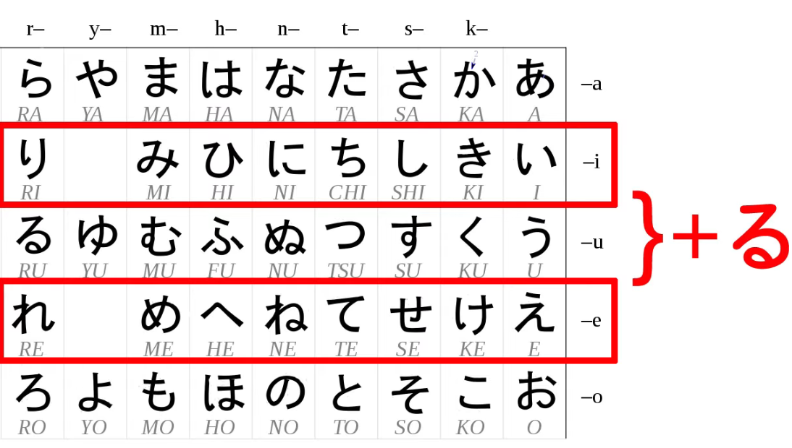

# 5. קבוצות פעלים וצורת-て

ביפנית אנחנו משתמשים בהטיות של פעלים באופן תמידי ובלתי נמנע, כל הטיה תלויה בהשתייכות של הפועל לקבוצה מסוימת של פעלים.

## פעלי איצ'ידן -  [一段]{いちだん}

הקבוצה הראשונה של פעלים ביפנית היא קבוצת איצ'ידן או `צעד-אחד`.
פעלי איצ'ידן חייבים להסתיים בתנועת `いる` או `える`:

:::danger כלל
כדי להטות פעלי איצ'ידן נשנה את האות `る`
:::

## פעלי גודאן - [五段]{ごだん}

הקבוצה השניה של פעלים, כוללת את המספר הגדול ביותר של פעלים.

כל הפעלים בקבוצה זו הם פעלים שהם לא איצ'ידן ונגמרים בצלילים: `う,つ,る,ぬ,ぶ,む,く,ぐ,す`

פעלים ביפנית תמיד נגמרים בצליל う, פעלי גודאן (5-צעדים) יכולים להגמר בכל צליל-う שהוא, כולל `-いる` ו`-える`, שלא כמו פעלי איצ'ידאן הם יכולים להסתיים גם ב `-おる`, `-ある`, או `-うる`.

:::warning מסקנה
הפעמים היחידות בהן יש לנו ספק במשפחת הפועל הן פעמים בהם הפועל מסתיים ב `-いる\-える`, מרבית הפעמים ידובר בפעלי איצ'ידאן אבל יש מספר פעלים יחסית קטן שהם פעלי גודאן שמסתיימים כך.

[וידאו מתקדם שמסביר על זה](https://www.youtube.com/watch?v=VDmaSJ4s6Qo)
:::

## פעלים לא-רגילים

הקבוצה השלישית של פעלים ביפנית - פעלים שלא נכנסים ל-2 הקבוצות הראשונות, למזלינו יש רק 2 פעלים כאלו:

* くる - לבוא
* する - לעשות
* 行く - ללכת (כמו `to go` לא `to walk`)

## צורת -て

עכשיו כשאנחנו מכירים את 3 הקבוצות נוכל להשתמש בהן כדי להפוך פעלים לצורת -て או -た. כפי שהסברנו בפרקים הקודמים אנחנו צריכים את הצורות הללו כדי להפוך פעלים (ומשפטים בפועל) לצורת הווה ועבר. בהמשך גם נשתמש בהן כדי להטות פעלים בצורות שונות ונוספות.

כמו שכבר ראינו, פעלי איצ'ידאן מאוד קלים - מחליפים る ב- て/た.

בהקשר של פעלי גודאן, כאן המשחק יותר קשוח, פעלי גודאן (5-שלבים) מתחלקים ל...אובכן... 5 תתי-קבוצות.

לפעלי גודאן יש סה"כ 5 סוגים של סיומות ומכאן מגיע השם.

1. うつる
2. ぬぶむ
3. く
4. ぐ
5. す

בפועל יהיו רק 4 קבוצות.

## קבוצת うつる

הקבוצה הראשונה היא `utsuru/うつる`. פעלים שנגמרים באחת מהאותיות `う`, `つ` או `る`.
אופן ההטייה הוא החלפת האות ב-`って`.

:::info דוגמה

1. [笑う]{わらう} -> [笑って]{わらって}
2. [持つ]{もつ} -> [持って]{もって}
3. [取る]{とる} -> [取って]{とって}

:::

## קבוצת ぬぶむ

הקבוצה הנשיה היא קבוצת ה `nubumu/ぬぶむ` - פעלים שנגמרים בעחת מהאותיות `ぬ`, `ぶ` או `む`.
אופן ההטייה הוא החלפת האות ב-`んで`.
כל האותיות האלו מאוד עצורות, ללא תנועה רצינית, תנו להגות אותן ותבינו במה מדובר, ככה קל יותר לזכור.

:::info דוגמה

1. [飲む]{のむ} -> [飲んで]{のんで}
2. [死ぬ]{しぬ} -> [死んで]{しんで}

:::

## קבוצת く/ぐ

את הקבוצה השלישית והרביעית נוכל לאחד לקבוצה אחת כי מדובר בקאנות `く`, `ぐ`.
אופן ההטייה הוא החלפת `く/ぐ` ב- `いて/いで` (או `いた/いだ` בהתאם)

:::info דוגמה

1. [歩く]{あるく} -> [歩いて]{あるいて}
2. [脱ぐ]{ぬぐ} -> [脱いで]{ぬいで}
3. [泳ぐ]{およぐ} -> [泳いで]{およいで}

:::

## הקבוצה す

הקבוצה האחרונה היא פעלים שנגמרים בקאנה `す`, ההטייה המתאימה היא החלפת `す` ב- `して`.

:::info דוגמה

1. [話す]{はなす} -> [話して]{話して}
2. [ます]{ます} -> [まして]{まして}

:::

## החריגים שלנו

כמו שאמרנו, יש פעלים שלא נכנסים בתבניות: [来る]{くる}, [する]{する}, [行く]{いく} וההטיות שלהם:

1. [来る]{くる} -> [来て]{きて}
2. [する]{する} -> [して]{して}
3. [行く]{いく} -> [行って]{いって}

סה"כ אלו הפעלים היחידים שהם חריגים, נזכור אותם.
