# 6. שמות תואר

ניזכר במה שדיברנו עליו בשיעור הראשון, משפטים ביפנית מחולקים ל-3 סוגים בסיסיים שמשתנים ביחס לקטר שלהם:

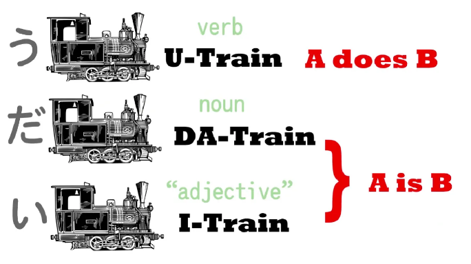

אמנם קטר-い מסמן משפטים שנוגעים לתארים אבל בפועל כל אחד מהקטרים שלנו יכול לעבוד כמו שם תואר!

## תארים מבוססי קטר-い

משפט פשוט שמשתמש בקטר הזה יכול להיות [ペンが赤い]{ペンがあかい}.

<!-- נזכור כי המילה `赤い` משמעותה לא `אדום` אלא `הוא-אדום`. -->

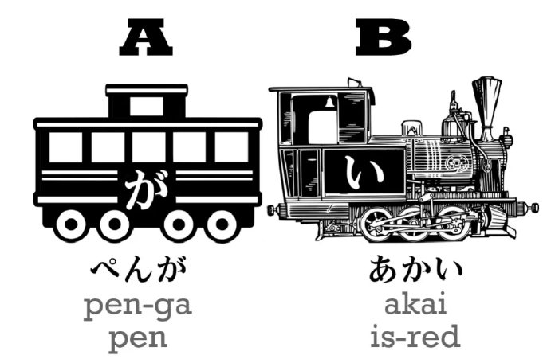

עכשיו נוכל להפוך את הקטר שלנו ללבן ולהחליף מקום בינו לבין הקרון, נקבל [赤いペンが]{あかいペンが}:

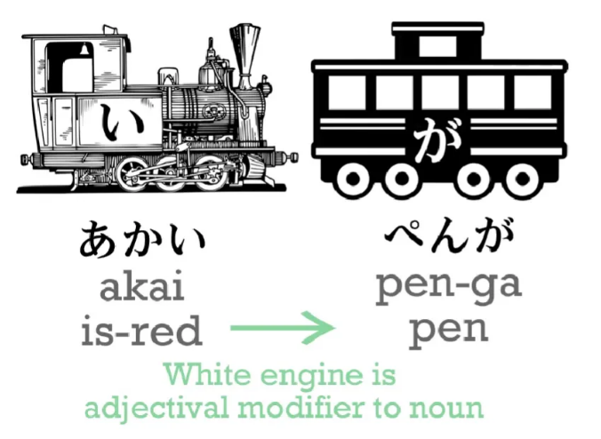

מה שקיבלו זה בעצם [赤いペン]{あかいペン} - `עט אדום` - זה לא משפט שלם, אפשר לראות גם שחסר לנו קטר אמיתי שימשוך את הרכבת.

אם נרצה נוכל לחבר קטר אחר לרכבת, לדוגמה קטר תואר אחר - [小さい]{ちいさい} - `קטן` ונקבל [赤いペンが小さい]{あかいペンがちいさい}

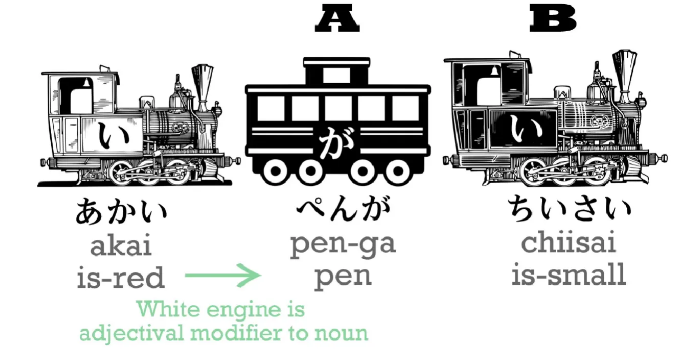

## שישמו בפעלים כתארים

:::danger כלל
כל קטר פועל, בכל הטייה, יכול לשמש גם כשם תואר.
:::

אם ניקח את המשפט [少女が歌った]{しょうじょがうたった} (`少女`-ילדה, `歌う`-לשיר) - `הילדה שרה` (נשים לב להטיה של "שרה" לפי השיעור הקודם)

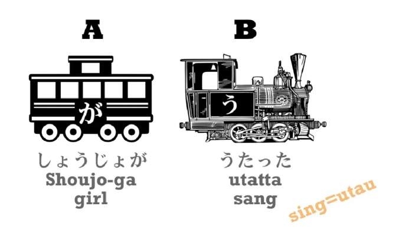

ונהפוך (שוב) את הקטר של הפועל ללבן ונשנה את מיקומו נקבל [歌った少女が]{うたったしょうじょが} - `הילדה ששרה`

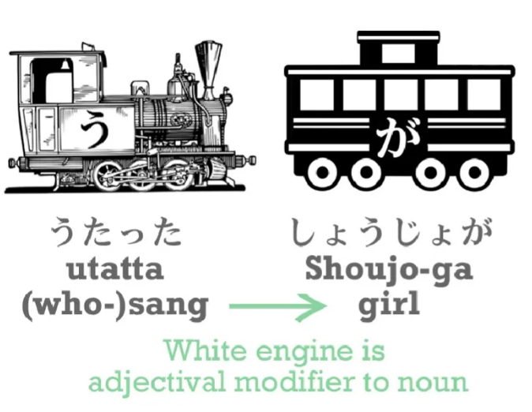

נבחין כי שוב - זה לא משפט שלם, צריך להוסיף קטר אמיתי כלשהו שיניע את הרכבת, נניח ניקח קטר פועל אחר שידבר על שינה ([寝る]{ねる}) נוכל להרכיב את המשפט: [歌った少女が寝ている]{うたったしょうじょがねている} - `הילדה ששרה ישנה (כרגע)`.

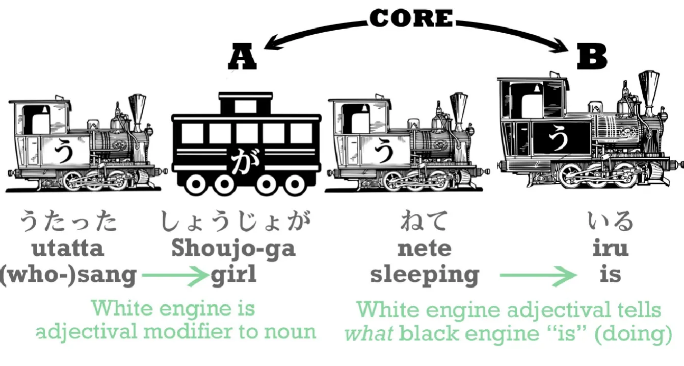

:::info דוגמה

[犬が辞書を食べた]{いぬがじしょをたべた} - `הכלב אכל את המילון`
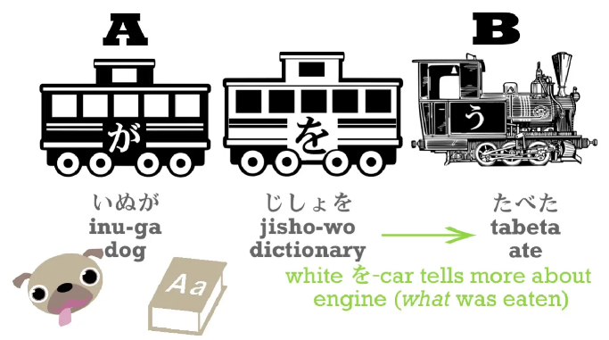

נחליף את הסדר שוב:

[辞書を食べた犬が]{じしょをたべたいぬが} - `הכלב שאכל את המילון` (לא משפט שלם)

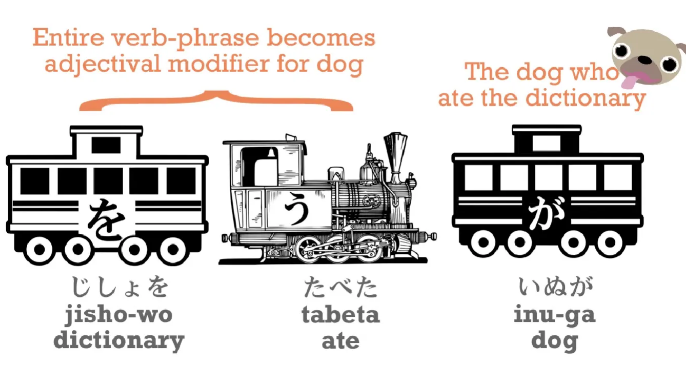

או בצורה אחרת נשנה ל:

[犬が食べた辞書]{いぬがたべたじしょ} - `המילון שנאכל על ידי הכלב`

> [!NOTE] הערה
> המשפט נראה כמשפט פסיבי אבל בהמשך נראה איך באמת מטים פעלים לפסיביות

ועכשיו אפשר גם לייצר משפט שלם, [辞書を食べた犬がやんちゃだ]{じしょをたべたいぬがやんちゃだ}. `やんちゃ` - `שובב/רע` - `הכלב שאכל את המילון הוא שובב`

:::

## שישמוב בשמות עצם מתארים

:::info הערה
הנושא גם נקרא `な-adjectives`
:::

כל מה שלמדנו עד עכשיו הוביל אותנו לדבר על **קטר** שמות העצם. ניקח את המשפט ממקודם: [辞書を食べた犬がやんちゃだ]{じしょをたべたいぬがやんちゃだ}, אם רק נשתמש בצירוף [犬がやんちゃだ]{いぬがやんちゃだ} נקבל משפט פשוט עם שם עצם. אבל אנחנו יכולים להפוך את הקטר שלנו ללבן ולהזיזו מלפני הקרון שמחזיק את הכלב, אם נעשה את זה  - נשנה את ה- `だ` (או `です`) שמגיע בסוף ל- `な`.

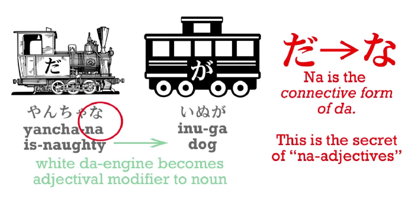

אז במקום [犬がやんちゃだ]{いぬがやんちゃだ}=`הכלב שובב` נקבל [やんちゃな犬]{やんちゃないぬ}=`(ה)כלב (ה)שובב` ונוכל להגיד: [やんちゃな犬が寝ている]{やんちゃないぬがねている} - `הכלב השובב ישן`.

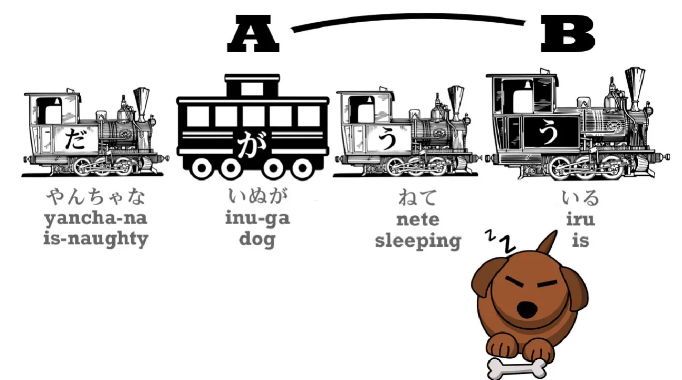

:::danger כלל
צריך לשים ❤️ שלא ניתן לעשות זאת עם כל שם עצם, אלא רק עם כאלו שיכולים להשתמש ב-`תארי-な`

:::

זה קצת מבלבל כיוון שאנחנו יוצרים כלל על שמות עצם בעזרת שימוש בתארים.

**האם אנחנו יכולים להשתמש בשמות עצם אחרים שלא נכללים כתארים? כן, אבל בדרכים אחרות.**

## קרון ה-の

כדי להסביר את זה צריך להציג קרון חדש, קרון ה-の. קרון ה-の הוא קרון קל מאוד להבנה, הוא מתפקד כמו המילה "של" בעברית או [כנטיית שייכות](https://mbakodesh.org.il/wp-content/uploads/2020/08/%D7%9E%D7%A6%D7%92%D7%AA-%D7%A9%D7%9E%D7%95%D7%AA-%D7%A2%D7%A6%D7%9D-%D7%95%D7%9B%D7%99%D7%A0%D7%95%D7%99%D7%99-%D7%A9%D7%99%D7%99%D7%9B%D7%95%D7%AA.pdf)

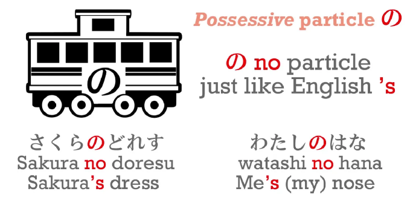

אז, [桜のドレス]{さくらのドレス} - `השמלה של סאקורה`. [私の花]{わたしのはな} - `הפרח שלי`.

לשמחתינו ביפנית אין `שלי`, `שלך`, `שלנו`, `שלכן` וכד', זה תמיד `の`.

---

מה שאנחנו מבינים זה שהסימנית `の` היא סימנית שייכות ולכן אפשרי להשתמש בה בעוד דרכים ולא רק בתור המילה `של`, כי הרי גם בעברית אנחנו יכולים לייצר שייכות בצורה שונה, לדוגמה `אני מתן מאינטל` - אני מתן ששייך לחברה בשם אינטל. גם ביפנית אפשרי להגיד את אותו דבר בעזרת הסימנית הזו - `intelのマタンだ`.

נוכל להשתמש בסימנית הזו בעוד דרכי שייכות:

:::info דוגמה
ביפנית יש צבעים כמו אדום [赤い]{あかい} שקיימים כתוצאה מההמרה של שם העצם [赤]{あか} לשם תואר.

לעומת זאת הצבע ורוד לא מאפשר זאת - [ピンク色]{ピンクいろ}. המילה [色]{いろ} משמעותה `צבע` - `צבע ורוד` אבל מדובר בעצם בשם עצם "צבע ורוד" וכדי להשתמש בו בתור תיאור (לדוגמה השמלה הורודה) צריך להשתמש בסימנית השייכות `の` - [ピンク色のドレス]{ピンクいろのドレス}.

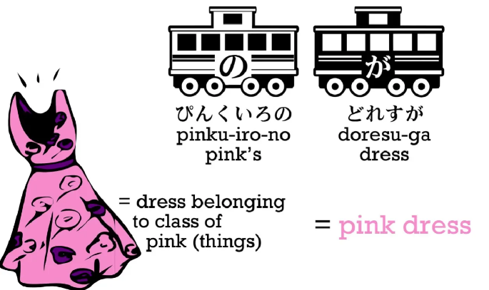
:::

ועוד דוגמה

:::info דוגמה
אם נרצה להגיד `פיטר הארנב` - נצטרך גם כן להשתמש בשייכות כיוון שנרצה להגיד בעצם `פיטר ששייך לקבוצת הארנבים` - `ウサギのピーター`
:::

סה"כ יש לנו כמה דרכים להציג תיאורים במשפטים, עם הזמן ועם שמיעה יומיומית נבין איזה שמות עצם משויכים לאיזו קבוצה (`な/の`) וכך נלמד בעצמינו איך להשתמש בהם.

[שאלות על החומר הנלמד עד כה](https://learnjapaneseonline.info/wp-content/uploads/2022/03/worksheet1.pdf)