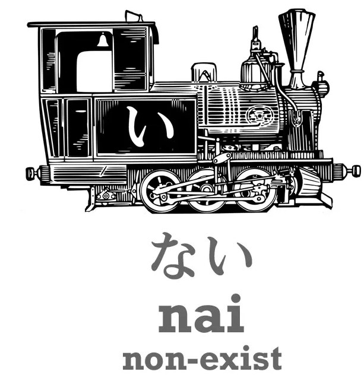
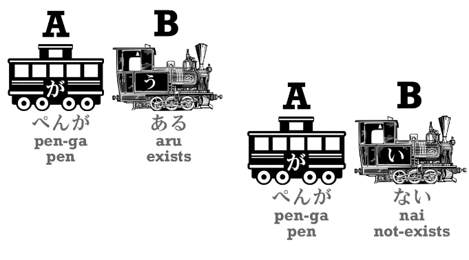
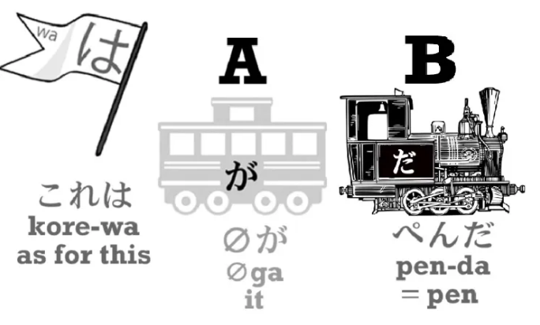
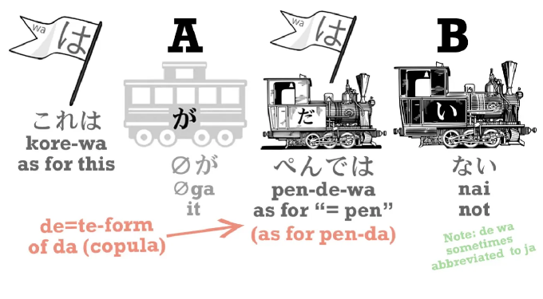
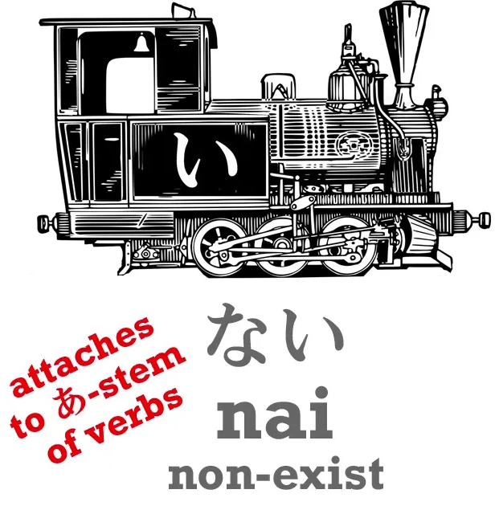
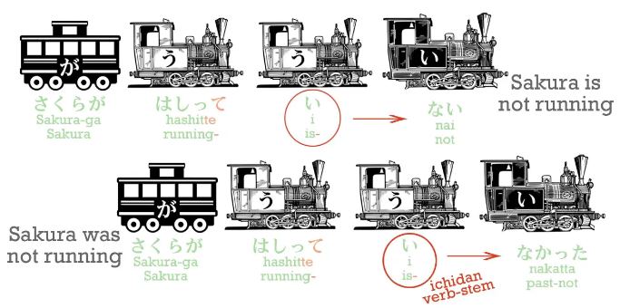
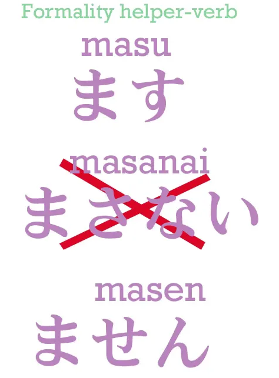
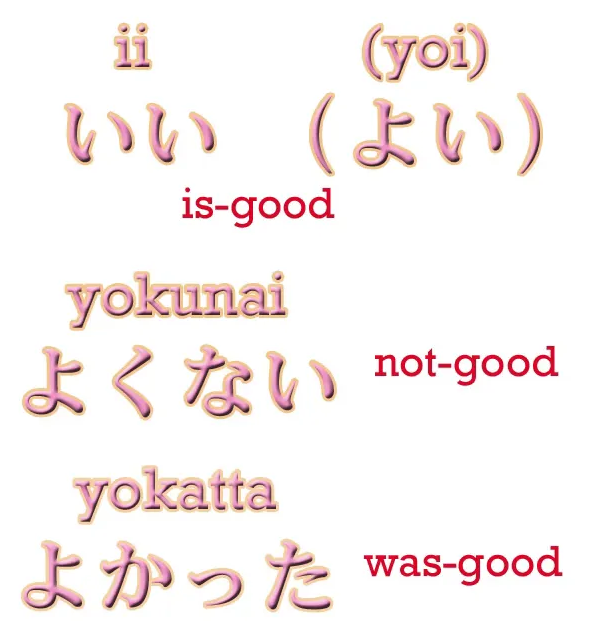

# 7. הטיית שלילה

## התיאור - ない

הבסיס לשלילה ביפנית הוא התיאור - `ない` שמשמעותו היא `לא קיים/לא להיות`.

המילה שמתארת קיום של משהו (דומם בלבד, כמו השמיים, הים, גרגר אורז וכד') היא `ある`. אם נרצה להגיד `יש עט/עט קיים` נגיד `ペンがある` ולכן אם נרצה להגיד ש`אין עט` נגיד - `ペンがない`.

:::info הערה
נשים ❤️ שהקטר של `ある` הוא קטר של פועל ואילו של `ない` הוא קטר תואר!
:::

למה אנחנו משתמשים בפועל בשביל לתאר קיום של משהו ואילו בתואר בשביל לתאר אי-קיום? כאשר **מקיימים** פעולה אנחנו צריך לבצע את הקיום ואילו כשאנחנו לא מקיימים פעולה אנחנו רק מתארים מצב שבו היא לא מתקיימת ומוסיפים `ない` לפועל ובכך הוא הופך לקטר של המשפט.

כעת אם נרצה להגיד `אין עט`, נגיד `ペンがない`. אבל אם נרצה להגיד `זה לא עט`? זה לא אותו דבר, איך אומרים את זה?

אם נרצה להגיד `זה עט` נגיד `これはペンだ`　- `באשר לזה, זה עט`

אבל אם נרצה להגיד את ההיפך `זה לא עט`, נגיד `これは(zeroが)ペンではない`

מה שקורה כאן:

1. `で` זה בעצם צורת-て של `だ/です`.
2. נשמור על תחילת המשפט כפי שכפר נאמר `これはペンだ` אבל בצורה המתאימה: `これはペンで`
3. נוסיף `ない`

סה"כ נקבל  את המשפט `これはペンではない` - `באשר לזה, באשר להיות זה עט, זה לא/ זה לא עט`.

## צורת שלילה של פעלים

כעת לשאלה המרכזית, איך מטים פועל לשלילה? בשביל זה נצטרך להשתמש ב-`ない` ולהוסיפו כסיפא לשורש-あ של הפועל.

:::info הערה
תחילה נתעסק בכלל שמדבר על פעלי גודאן ובהמשך נסביר על איצ'יאדן (מאוד פשוט)
:::

מה הכוונה? לכל פועל יש 5 שורשים שונים (שורש לכל צליל קאנה), השורש המרכזי כמובן הוא שורש-う:

<table style="border-collapse: collapse; width: 100%; font-family: sans-serif; text-align: center;">
  <thead>
    <tr style="border-bottom: 2px solid #ddd;">
      <th style="padding: 10px;">שורש-あ</th>
      <th style="padding: 10px;">שורש-い</th>
      <th style="padding: 10px; background-color: #95414e; color: white;">שורש-う</th>
      <th style="padding: 10px;">שורש-え</th>
      <th style="padding: 10px;">שורש-お</th>
      <th style="padding: 10px;">דוגמה</th>
      <th style="padding: 10px;">תרגום</th>
    </tr>
  </thead>
  <tbody>
    <tr style="border-bottom: 1px solid #eee;">
      <td style="padding: 8px;">あ</td><td style="padding: 8px;">い</td>
      <td style="padding: 8px; background-color: #95414e; color: white;">う</td>
      <td style="padding: 8px;">え</td><td style="padding: 8px;">お</td>
      <td style="padding: 8px;"><ruby>買<rp>【</rp><rt>か</rt><rp>】</rp>う<rt></rt></ruby></td>
      <td style="padding: 8px;">לקנות</td>
    </tr>
    <tr style="border-bottom: 1px solid #eee;">
      <td style="padding: 8px;">か</td><td style="padding: 8px;">き</td>
      <td style="padding: 8px; background-color: #95414e; color: white;">く</td>
      <td style="padding: 8px;">け</td><td style="padding: 8px;">こ</td>
      <td style="padding: 8px;"><ruby>聞<rp>【</rp><rt>き</rt><rp>】</rp>く<rt></rt></ruby></td>
      <td style="padding: 8px;">לשמוע / להקשיב</td>
    </tr>
    <tr style="border-bottom: 1px solid #eee;">
      <td style="padding: 8px;">さ</td><td style="padding: 8px;">し</td>
      <td style="padding: 8px; background-color: #95414e; color: white;">す</td>
      <td style="padding: 8px;">せ</td><td style="padding: 8px;">そ</td>
      <td style="padding: 8px;"><ruby>話<rp>【</rp><rt>はな</rt><rp>】</rp>す<rt></rt></ruby></td>
      <td style="padding: 8px;">לדבר</td>
    </tr>
    <tr style="border-bottom: 1px solid #eee;">
      <td style="padding: 8px;">た</td><td style="padding: 8px;">ち</td>
      <td style="padding: 8px; background-color: #95414e; color: white;">つ</td>
      <td style="padding: 8px;">て</td><td style="padding: 8px;">と</td>
      <td style="padding: 8px;"><ruby>持<rp>【</rp><rt>も</rt><rp>】</rp>つ<rt></rt></ruby></td>
      <td style="padding: 8px;">להחזיק</td>
    </tr>
    <tr style="border-bottom: 1px solid #eee;">
      <td style="padding: 8px;">な</td><td style="padding: 8px;">に</td>
      <td style="padding: 8px; background-color: #95414e; color: white;">ぬ</td>
      <td style="padding: 8px;">ね</td><td style="padding: 8px;">の</td>
      <td style="padding: 8px;"><ruby>死<rp>【</rp><rt>し</rt><rp>】</rp>ぬ<rt></rt></ruby></td>
      <td style="padding: 8px;">למות</td>
    </tr>
    <tr style="border-bottom: 1px solid #eee;">
      <td style="padding: 8px;">ば</td><td style="padding: 8px;">び</td>
      <td style="padding: 8px; background-color: #95414e; color: white;">ぶ</td>
      <td style="padding: 8px;">べ</td><td style="padding: 8px;">ぼ</td>
      <td style="padding: 8px;"><ruby>飛<rp>【</rp><rt>と</rt><rp>】</rp>ぶ<rt></rt></ruby></td>
      <td style="padding: 8px;">לעוף / לקפוץ</td>
    </tr>
    <tr style="border-bottom: 1px solid #eee;">
      <td style="padding: 8px;">ま</td><td style="padding: 8px;">み</td>
      <td style="padding: 8px; background-color: #95414e; color: white;">む</td>
      <td style="padding: 8px;">め</td><td style="padding: 8px;">も</td>
      <td style="padding: 8px;"><ruby>飲<rp>【</rp><rt>の</rt><rp>】</rp>む<rt></rt></ruby></td>
      <td style="padding: 8px;">לשתות</td>
    </tr>
    <tr style="border-bottom: 1px solid #eee;">
      <td style="padding: 8px;">ら</td><td style="padding: 8px;">り</td>
      <td style="padding: 8px; background-color: #95414e; color: white;">る</td>
      <td style="padding: 8px;">れ</td><td style="padding: 8px;">ろ</td>
      <td style="padding: 8px;"><ruby>取<rp>【</rp><rt>と</rt><rp>】</rp>る<rt></rt></ruby></td>
      <td style="padding: 8px;">לקחת</td>
    </tr>
  </tbody>
</table>

הפעם נסתכל רק על שורש-あ כי הוא השורש שאנחנו צריכים כדי להסביר את הנושא.
בצורה פשוטה, כדי לקבל את הפועל בשורש-あ רק צריך להזוז את העמודה לעמודת השורש המתאימה ולשנות על פיה את הפועל.

<table style="border-collapse: collapse; width: 100%; font-family: sans-serif; text-align: center;">
  <thead>
    <tr style="border-bottom: 2px solid #ddd;">
      <th style="padding: 10px; background-color: #4dba56; color: white;">שורש-あ</th>
      <th style="padding: 10px;">שורש-い</th>
      <th style="padding: 10px; background-color: #95414e; color: white;">שורש-う</th>
      <th style="padding: 10px;">שורש-え</th>
      <th style="padding: 10px;">שורש-お</th>
      <th style="padding: 10px;">דוגמה</th>
      <th style="padding: 10px;">תרגום</th>
    </tr>
  </thead>
  <tbody>
    <tr style="border-bottom: 1px solid #eee;">
      <td style="padding: 8px; background-color: #4dba56; color: white;">あ</td><td style="padding: 8px;">い</td>
      <td style="padding: 8px; background-color: #95414e; color: white;">う</td>
      <td style="padding: 8px;">え</td><td style="padding: 8px;">お</td>
      <td style="padding: 8px;"><ruby>買<rp>【</rp><rt>か</rt><rp>】</rp>う<rt></rt></ruby> → <ruby>買<rp>【</rp><rt>か</rt><rp>】</rp>わ<rt></rt></ruby></td>
      <td style="padding: 8px;">לקנות</td>
    </tr>
    <tr style="border-bottom: 1px solid #eee;">
      <td style="padding: 8px; background-color: #4dba56; color: white;">か</td><td style="padding: 8px;">き</td>
      <td style="padding: 8px; background-color: #95414e; color: white;">く</td>
      <td style="padding: 8px;">け</td><td style="padding: 8px;">こ</td>
      <td style="padding: 8px;"><ruby>聞<rp>【</rp><rt>き</rt><rp>】</rp>く<rt></rt></ruby> → <ruby>聞<rp>【</rp><rt>き</rt><rp>】</rp>か<rt></rt></ruby></td>
      <td style="padding: 8px;">לשמוע</td>
    </tr>
    <tr style="border-bottom: 1px solid #eee;">
      <td style="padding: 8px; background-color: #4dba56; color: white;">さ</td><td style="padding: 8px;">し</td>
      <td style="padding: 8px; background-color: #95414e; color: white;">す</td>
      <td style="padding: 8px;">せ</td><td style="padding: 8px;">そ</td>
      <td style="padding: 8px;"><ruby>話<rp>【</rp><rt>はな</rt><rp>】</rp>す<rt></rt></ruby> → <ruby>話<rp>【</rp><rt>はな</rt><rp>】</rp>さ<rt></rt></ruby></td>
      <td style="padding: 8px;">לדבר</td>
    </tr>
    <tr style="border-bottom: 1px solid #eee;">
      <td style="padding: 8px; background-color: #4dba56; color: white;">た</td><td style="padding: 8px;">ち</td>
      <td style="padding: 8px; background-color: #95414e; color: white;">つ</td>
      <td style="padding: 8px;">て</td><td style="padding: 8px;">と</td>
      <td style="padding: 8px;"><ruby>持<rp>【</rp><rt>も</rt><rp>】</rp>つ<rt></rt></ruby> → <ruby>持<rp>【</rp><rt>も</rt><rp>】</rp>た<rt></rt></ruby></td>
      <td style="padding: 8px;">להחזיק</td>
    </tr>
    <tr style="border-bottom: 1px solid #eee;">
      <td style="padding: 8px; background-color: #4dba56; color: white;">な</td><td style="padding: 8px;">に</td>
      <td style="padding: 8px; background-color: #95414e; color: white;">ぬ</td>
      <td style="padding: 8px;">ね</td><td style="padding: 8px;">の</td>
      <td style="padding: 8px;"><ruby>死<rp>【</rp><rt>し</rt><rp>】</rp>ぬ<rt></rt></ruby> → <ruby>死<rp>【</rp><rt>し</rt><rp>】</rp>な<rt></rt></ruby></td>
      <td style="padding: 8px;">למות</td>
    </tr>
    <tr style="border-bottom: 1px solid #eee;">
      <td style="padding: 8px; background-color: #4dba56; color: white;">ば</td><td style="padding: 8px;">び</td>
      <td style="padding: 8px; background-color: #95414e; color: white;">ぶ</td>
      <td style="padding: 8px;">べ</td><td style="padding: 8px;">ぼ</td>
      <td style="padding: 8px;"><ruby>飛<rp>【</rp><rt>と</rt><rp>】</rp>ぶ<rt></rt></ruby> → <ruby>飛<rp>【</rp><rt>と</rt><rp>】</rp>ば<rt></rt></ruby></td>
      <td style="padding: 8px;">לעוף</td>
    </tr>
    <tr style="border-bottom: 1px solid #eee;">
      <td style="padding: 8px; background-color: #4dba56; color: white;">ま</td><td style="padding: 8px;">み</td>
      <td style="padding: 8px; background-color: #95414e; color: white;">む</td>
      <td style="padding: 8px;">め</td><td style="padding: 8px;">も</td>
      <td style="padding: 8px;"><ruby>飲<rp>【</rp><rt>の</rt><rp>】</rp>む<rt></rt></ruby> → <ruby>飲<rp>【</rp><rt>の</rt><rp>】</rp>ま<rt></rt></ruby></td>
      <td style="padding: 8px;">לשתות</td>
    </tr>
    <tr style="border-bottom: 1px solid #eee;">
      <td style="padding: 8px; background-color: #4dba56; color: white;">ら</td><td style="padding: 8px;">り</td>
      <td style="padding: 8px; background-color: #95414e; color: white;">る</td>
      <td style="padding: 8px;">れ</td><td style="padding: 8px;">ろ</td>
      <td style="padding: 8px;"><ruby>取<rp>【</rp><rt>と</rt><rp>】</rp>る<rt></rt></ruby> → <ruby>取<rp>【</rp><rt>と</rt><rp>】</rp>ら<rt></rt></ruby></td>
      <td style="padding: 8px;">לקחת</td>
    </tr>
  </tbody>
</table>

:::danger כלל

נשים ❤️ לחריגה הקטנה ב- [買う]{かう} שהופך ל- [買わ]{かわ} כמובן כי לעבור ל-`あ` לא מתגלגל על הלשון (תנסו).

לכן במעבר משורש-`う` בפעלים שנגמרים ב-`う` נעבור ל-`わ` במקום ל-`あ`

:::

לבסוף כדי לעבור לשלילה פשוט נוסיף `ない`. בדרך זו נקבל פעלים בשלילה כמו [買わない]{かわない}-`לא קונה`, [持たない]{もたない}-`לא מחזיק`, וכן הלאה.

ובהקשר לפעלי איצ'ידאן:

:::danger כלל
כדי להמיר פעלי איצ'יאדן לשלילה פשוט נחליף את ה-`る` בסופם ב-`ない`. כך יהפוך [食べる]{たべる} ל-[食べない]{たべない}

:::

## שלילה של תארים

כמו שאנחנו יודעים כל תואר ביפנית מסתיים ב-`い` ולכן כדי להפוך תואר לשלילה נעשה זאת בשני שלבים:

1. נהפוך את `い` ל-`く`
2. נוסיף `ない`

:::info דוגמה
נהפוך את התואר `אדום` ל- `לא-אדום`

1. [赤い]{あかい} -> [赤く]{あかく}
2. [赤く]{あかく} -> [赤くない]{あかくない}

ואכן, `לא-אדום` זה [赤くない]{あかくない}
:::

:::info דוגמה
נהפוך את התואר `מפחיד` ל- `לא-מפחיד`

1. [怖い]{こわい} -> [怖く]{こわく}
2. [怖く]{こわく} -> [怖くない]{こわくない}

ואכן, `לא-מפחיד` זה [怖くない]{こわくない}
:::

:::info הערה
בצורה דומה אנחנו גם בונים את צורת-て של תואר, במקום להוסיף `ない` בסוף, מוסיפים `て` - [赤い]{あかい} -> [赤くて]{あかくて}
:::

## תארים בלשון עבר

כדי להפוך תארים ללשון עבר נחליף את הסיפא `い` ב- `かった`.

:::info דוגמה
מפחיד - [怖い]{こわい} יהפוך ל- [怖かった]{こわかった}-`הפחיד`
:::

באותה צורה כיוון שאמרנו ש-`ない` זה תואר, כדי להפוך אותו ללשון עבר נעשה את אותו דבר ונקבל `なかった`. אז אם נרצה להגיד `סאקורה רץ` נגיד [桜が走る]{さくらがはしる} ובהתאם לכך בשלילה - [桜が走らない]{さくらがはしらない}.

בעבר נגיד `סאקורה רץ (בעבר)`-[桜が走った]{さくらがはしった} ובשלילה [桜が走らなかった]{さくらがはしらなかった}

:::info הסבר

[走る]{はしる} -> [走らない]{はしらない} -> [走らなかった]{はしらなかった}

:::

בהתאם לפעלים בהווה מתמשך וכפי שכבר הזכרנו אם נרצה להגיד `סאקורה רץ (כרגע)` נגיד [桜が走っている]{さくらがはしっている}　ובעבר [桜が走っていた]{さくらがはしっていた}.

כעת, אם נרצה לשלול את האחרון נזכור ש- `いた` זה בעצם זמן עבר של `いる` וזה פועל איצ'ידאן פשוט, נחליף את `た` בשלילה שלה - `ない` ונעביר לעבר ונקבל `なかった` - סה"כ המשפט השלם בשלילת עבר: [桜が走っていなかった]{さくらがはしっていなかった}

## חריגות

יש סה"כ 2 חריגות לכל מה שדיברנו עליו בפרק הזה.

החריגה הראשונה היא הפועל `ます` שהוא פועל עזר שהופך מילים לפורמליות, מוסיפים אותו לשורש-い של פעלים כדי לקבל פועל בגרסה הפורמלית (מכבדת) לדוגמה [話す]{はなす} הופך ל-[話します]{はなします} ואת הפועל הזה לא שוללים בעזרת `ない` אלא מטים אותו והופכים אותו ל-`ません`, כיוון שזה פועל "מיושן" לא משתמשים במילה `ない`.

החריגה השניה היא התואר `いい/良い`-`(זה) טוב`. למילה זו יש הגהה יותר מיושנת, `よい/良い` שעדיין משתמשים בה ולכן כשאנחנו מטים את המילה `いい` משתמשים במילים הישנה ומטים אותה.

:::info דוגמה
אם נהפוך את `いい` לעבר נקבל `よかった` **ולא** `いかった`
:::

:::info הערה
המילה `よかった` היא מילה שמשתמשים בה רבות ומשמעותה מעין `היה טוב/יצא טוב/הכל לטובה/תודה לאל (שמשהו קרה) וכד'`.
:::

אם רוצים להגיד שמשהו לא טוב ניתן להגיד `よくない` (נהוג להשתמש במילים אחרות).

