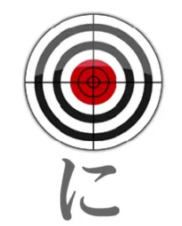
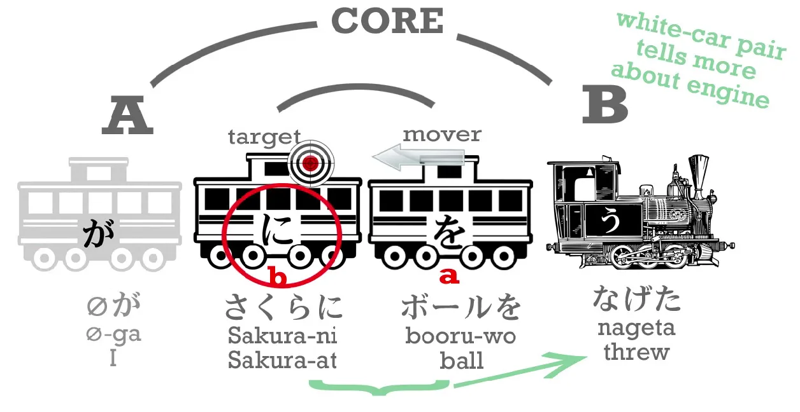
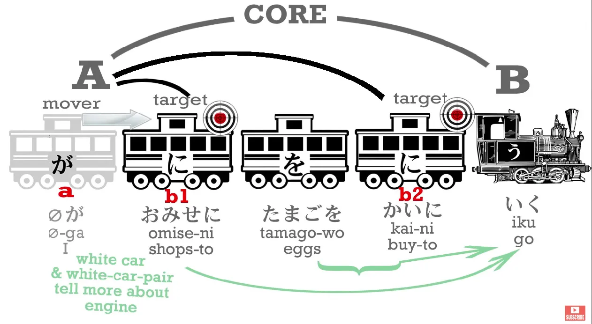
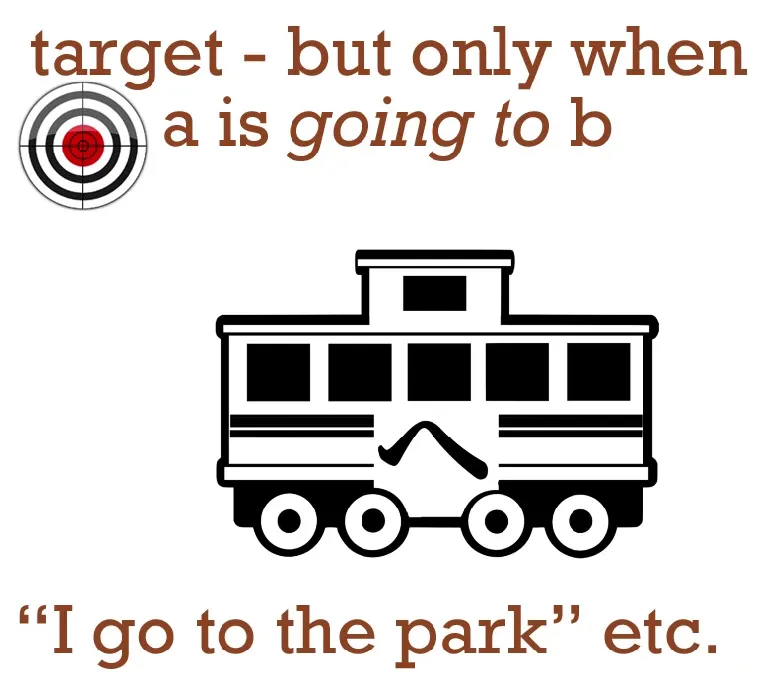

# 8. סימניות に ו- へ

## סימנית に

נתחיל מלדבר על סימנית-に, כבר ראינו אותה בפעולה בעבר.

נזכור שסימנית זו מסמנת **מטרה**

כשדיברנו על הסימנית-に אמרנו שתפקידה לסמן את **את המטרה הסופית של פעולה** במשפט.

:::info דוגמה
[桜にボールを投げた]{さくらにボールをなげた} - זרקתי את הכדור סאקורה

הכדור מסומת ב-を כי זה האובייקט שאני זרקתי ואני מסומן ב-が (בלתי נראה), סאקורה מסומן ב-に כי הוא **המטרה** אלי זרקתי את הכדור.
:::

סימנית-に תמיד מסמנת את המטרה, בין אם מדובר במקום אליו אנחנו הולכים/נוסעים/טסים ובין אם מקום אליו/עליו אנחנו שולחים/זורקים/שמים משהו. **אנחנו משתמשים ב-に כדי לסמן את `המקום` הזה**.

:::danger כלל
אם א' הולך ל-ב' אז אז ב' מסומן ב-に.

במילים אחרות אפשר להסתכל על に בתור `ל` במילה `לפארק` או `על` במשפט `אני זורק על סאקורה` - בדיוק כמו שאנחנו מוסיפים בעברית את התוספות הללו למילים כך גם ביפנית צריך.
:::

:::info דוגמה

* [公園に行く]{こうえんにいく} - אני הולך לפארק
* [店に行く]{みせにいく} - אני הולך לחנות
:::

במילים אחרות, הסימנית に מסמנת לנו מקום/מטרה פיזיים אליה אנחנו ניגשים. אבל אנחנו יכולים להשתמש בסימנית-に גם כדי לסמן מטרות לא פיזיות.

:::info דוגמה **חשובה**

אם נרצה להביא את את המטרה שלנו בזה שקפצנו לסופר לקנות ביצים? הרי שיש לנו 2 מטרות במשפט - `הלכתי לסופר כדי (במטרה) לקנות ביצים`:

1. לקנות ביצים
2. לסופר

מדובר במטרה פיזית ובמטרה לא פיזית!
נבנה את המשפט בחלקים:

1. `zeroが` - אני (בלתי נראה)
2. [店に]{みせに} -  לחנות (מטרה פיזית)
3. [卵を]{たまごを} - ביצים
4. [買いに]{かいに} - במטרה לקנות
5. [行く]{いく} - הלכתי

[店に卵を買いに行く]{みせにたまごをかいにいく} - `הלכתי לסופר כדי (במטרה) לקנות ביצים`

> יש רישא お לפני みせ - מדובר בתחילית שמסמלת על כבוד, לא מהותי כרגע.
:::info הערה
נשים ❤️ כי הפועל לקנות (`買う`) עבר הטייה לשורש-い עליו דיברנו בשיעור 7.5, הטיה זו הופכת את הפעולה `לקנות` לשם עצם, כך בעצם נקבל את הצירוף [買いに行く]{かいにいく} - `ללכת במטרה לקנות`
:::

בדוגמה האחרונה ראינו שמשפט יכולות להיות גם 2 מטרות, אין הגבלה מסוימת על מספר המטרות במשפט.

### סימנית-に כמטרה שהושגה

ניתן להשתמש בסימנית-に גם כדי לסמן מטרה שכבר הושגה, לדוגמה לדבר על מקום שאתם כבר נמצאים בו

:::info דוגמה

* מטרה שעוד לא הושגה: [お店に行く]{おみせにいく} - `אני הולך לחנות`
* מטרה שכבר הושגה: [お店にいる]{おみせにいる} - `אני בחנות`

או

* מטרה שעוד לא הושגה: [公園に行く]{こうえんにいく} - `אני הולך לפארק`
* מטרה שהושגה: [公園にいる]{こうんにいる} - `אני בפארק`

:::

---
אנחנו משתמשים בסימנית-に גם לאובייטקים דוממים: [本はテーブルの上にある]{ほんはテーブルのうえにある} - `הספר על השולחן`. [上]{うえ} - `על/מעל` הוא שם עצם ולכן ניתן להשתמש בו כאן.

### שימוש בסימנית-に　לסימון מטרה של שינוי

השימוש האחרון של סימנית-に הוא סימון של מטרה לשינוי.
אם נרצה להגיד `א' הופך ל-ב'` נשתמש בסימנית に.

:::info דוגמה

[桜はカエルになった]{さくらはカエルになった} - `סאקורה הפך לצפרדע`
> `カエル` - צפרדע
>
> `なる` - להפוך

כאן סימנית に מסמנת את הצפרדע (למה סאקורה נהפך).
:::

:::info דוגמאות נוספות

* [今年十八歳になる]{ことしじゅうはちさいになる} - `השנה אהיה (אהפוך ל) בן 18`.
* [後で曇りになる]{あとでくもりになる} - `אחר כך יהפוך למעונן`.

:::

### שימוש ב-に עבור שמות תואר

כדי להשתמש בסימנית-に יחד עם שמות תואר צריך לשנות אותם קצת - נשתמש בשורש של התואר ונוסיף `く`.

:::info דוגמה
אם נרצה להגיד `סאקורה יפה` נגיד [桜が美しい]{さくらがうつくしい}
> [美しい]{うつくしい} = יפה

ואם נרצה להגיד `סאקורה הפכה ליפה` נגיד [桜が美しくなった]{さくらがうつくしくなった}

> השורש של [美しい]{うつくしい} הוא [美し]{うつくし} אליו מוסיפים `く` ואת `なる` בעבר (`なった`) ומקבלים [美しくなった]{うつくしくなった} - הפך/ה ליפה.
:::

## סימנית へ

לפני שנסיים את החלק הזה נכיר קרון חדש ברכבת שלנו - קרון-へ. זה קרון מאוד מאוד פשוט לשימוש, הסימנית `へ` שהיא בעצם הקאנה `へ` מבוטאת בשימוש הזה בתור `e` ולא `he`, השימוש דומה מאוד ל-に רק שהסימנית הזו משומשת רק כאשר אובייקט א' הולך/זז/מתקרב/וכו' לאובייקט ב'.

במילים אחרות משתמשים בסימנית-へ רק כאשר אנחנו מתקדמים לכיוון כלשהו שהוא לא המטרה הסופית שלנו בהכרח. או בפשטות, זה יכול להחליף את הצירוף `בדרך ל...` או `לכיוון...`

:::info דוגמה

* [公園へ行く]{こうえんへいく} - `אני בדרך לפארק`
* [どこへ行く]{どこへいく} - `לאן אלך?`
* [まっすぐへ]{まっすぐへ} - `(לכיוון) קדימה` (שאלנו לאן ללכת וענו לנו את זה)
:::

נדבר על זה קצת יותר בפרק הבא שמרחיב על סימניות ביפנית.