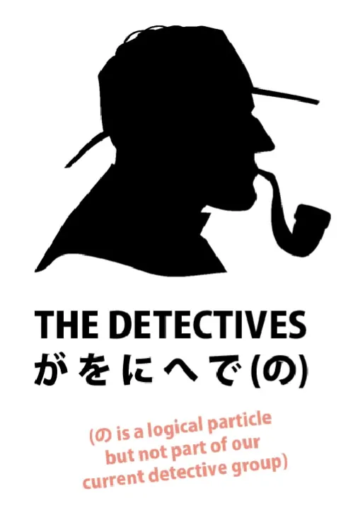
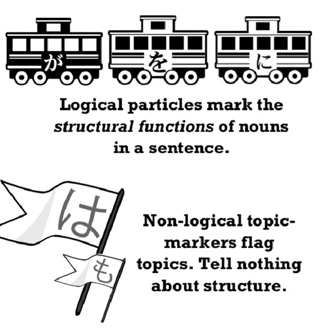
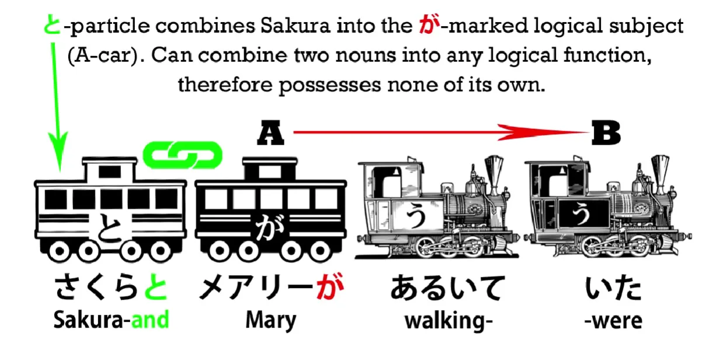
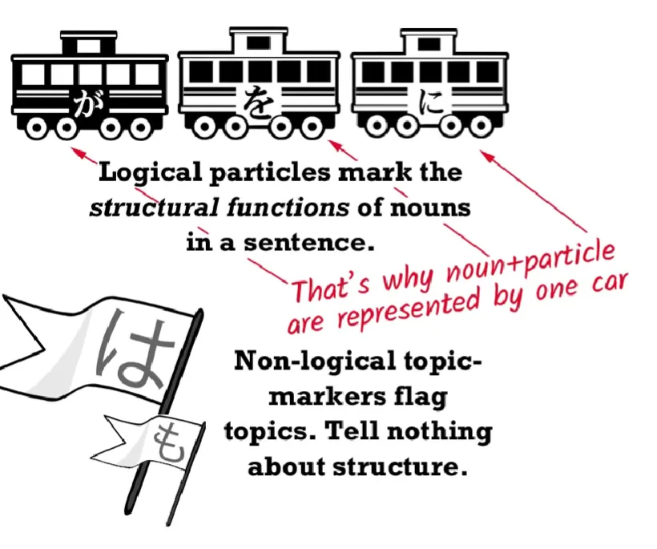
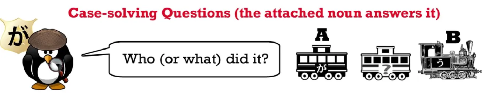
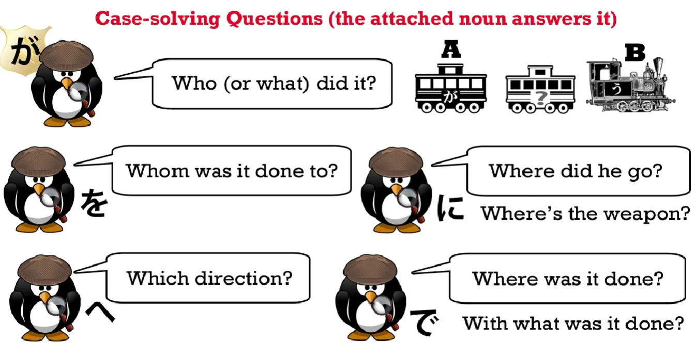
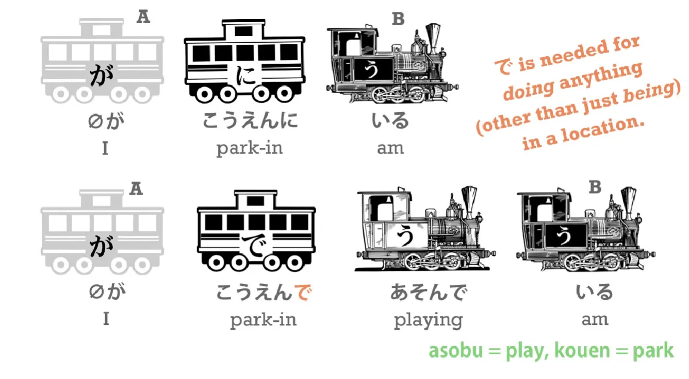
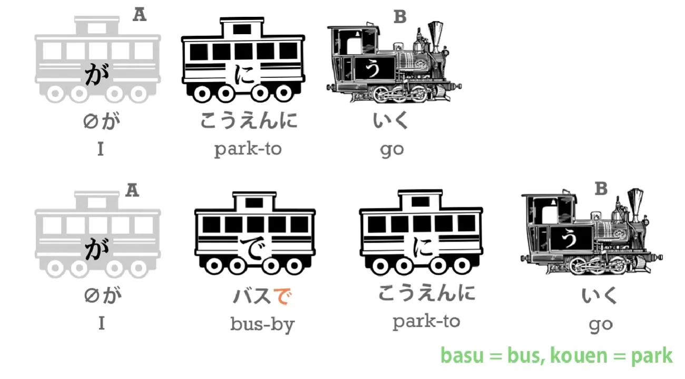

# 8.ב. סימניות ביפנית

עד כה ראינו כבר כמה סימניות שונות ביפנית ואכן הסימניות ביפנית הן אחד מאבני הבניין הכי חשובים בשפה - בלעדיהן לא נוכל להבין כלום!

כמו שבעברית אנחנו מבינים משפטים בעזרת מילות קישור ואותיות שעוזרות לנו להבין שייכות כך גם ביפנית, יש חלקיקים/סימניות שעוזרים לנו להבין הקשרים ומבנים במשפט.

**תפקיד הסימניות הלוגיות ביפנית הוא לקשר בין שמות עצם ובין שמות עצם לפעלים במשפט**

## סימניות לוגיות

אז מה זה בעצם?

כפי שאנחנו זוכרים יש לנו סימניות לוגיות וסימניות לא-לוגיות.
סימניות לוגיות לדוגמה הן `に`, `を`, `が` ואילו סימניות לא-לוגיות לדוגמה הן `は`, `も`.

:::warning מסקנה

סימניות לוגיות עוזרות לנו להבין את הלוגיקה במשפט - מי עשה מה למי ומתי ואילו סימניות לא-לוגיות לא תורמות לנו להבנת המשפט או הסיטואציה. דוגמה טובה זו סימנית-は שרק אומרת לנו מה הנושא הכללי במשפט (לא נשוא או משהו קונקרטי).

:::

---

ישנן סימניות נוספות שנוכל להגדיר כסימניות א-לוגיות. לא לוגיות וגם לא לא-לוגיות. דוגמה טובה זו סימנית-と שמחברת שני שמות עצם ביחד.

:::info דוגמה
[桜とジョンが歩いている]{さくらとジョンがあるいている} - `סאקורה וג'ון הולכים`.

:::

הסימנית が מסמן מי הולך וסימנית と מחברת את סאקורה וג'ון (או מרי). במילים אחרות סימנית と לא אומרת מה הם עושים, איפה הם עושים וכן הלאה.

דבר חשוב נוסף שיש לזכור בקשר לסימניות לוגיות - **הן תמיד מחוברות לשם עצם כלשהו** וזה עובד גם הפוך (כמו אם"ם במתמטיקה) - אם רואים מילה שמקושרת אליה סימנית כלשהיא, ישר נסיק שהיא שם עצם!
זו גם הסיבה שבגלל אנחנו רואים תמיד שקרון של סימנית כולל עימו שם עצם!

---

## סימנית が

הסימנית הראשית והחשובה ביפנית היא が

:::danger כלל
הסימנית が **חייבת להמצא בכל משפט**.
לפעמים הסימנית תתפקד בתור סוכן חשאי שאנחנו לא רואים בשטח (`zeroが`) ובעצם "תיעלם" מהמשפט (אבל היא עדיין שם!).
:::

הסימנית が תימצא במשפטים מהצורה `א' הוא ב'` - משפטים שמתארים/מספרים לנו מה הוא דבר מסוים (שם עצם).

---

סימניות אחרות לא יכולות לעשות זאת, הן יכולים להשיג משפטים מהצורה `א' עושה ב'` ותו לא (במילים אחרות משפטים עם מנוע פעולה).

במילים אחרות, אם נקביל את הסימניות שוב לעבודת בילוש - בלש-が עובד בעבודה המשרדית שמתארת כל חקירה וחקירה ואילו שאר הסימניות עובדות בעבודת שטח - פועלים! בלש-が שואל בסופו של דבר `מי עשה את זה?`

והשאלה האחרונה היא שאלה שנשאלת או נענית **בכל משפט** לא משנה באיזה שפה ולכן - הקרון של סימנית が הוא שחור.

**כיוון שהבסיס לכל משפט הוא `מי עשה את הפעולה?`, סימנית が אחראית לשאול את השאלה הזו** כאשר שאר הסימניות שואלות שאלות אחרות על המקרה ועוזרות לקבל את התמונה המלאה.

## סימניות を、に、へ

נמשיך עם ההקבלה לבלשים בחקירה כדי להסביר את הסימניות הללו:

* **סימנית を שואלת `למי זה נעשה? מי קיבל את התוצאה של הפעולה?`**
* **סימנית に שואלת `לאן הוא הלך?` או `איפה הנשק?`**
* **סימנית へ שואלת `לאיזה כיוון הוא הלך?`**

:::info הערה
השאלה ששואלת סימנית へ מאוד דומה לשאלה של סימנית に נכון?

אבל אנחנו לא תמיד נדע לאן הפושע הולך/מכוון במדויק ולכן אנחנו נשאל **לאיזה כיוון הוא הלך**, האם זה צפון? דרום? אולי לכיוון הבית של סאקורה? (אבל לא בהכרח לבית עצמו).

אלו שאלות דומות אבל שונות.
:::

## סימנית で

עכשיו נסתכל על בלש で.

**בלש で שואל את השאלה `איפה זה נעשה?` ואת השאלה `עם מה זה נעשה? מה היה כלי הנשק?`**

אם נגיד [（zeroが）公園にいる]{がこうえんにいる} - `(אני) בפארק`, אבל אם נרצה להגיד `(אני) משחק בפארק` נצטרך להגיד [（zeroが）公園で遊んでいる]{がこうえんであそんでいる} כיוון שכדי לבטא שאנחנו עושים משהו במקום מסוים נצטרך להשתמש בסימנית で.

כמו כן **נשתמש בסימנית で כדי לבטא את האמצעים בהם אנחנו משתמשים כדי לעשות משהו** אז אם נגיד [（zeroが）公園に行く]{がこうえんにいく} - `(אני) הולך לפארק` ונרצה לשנות זאת כדי להגיד `(אני) משתמש באוטובוס כדי להגיע לפארק` אז נגיד [（zeroが）バスで公園に行く]{がバスでこうえんにいく}.

